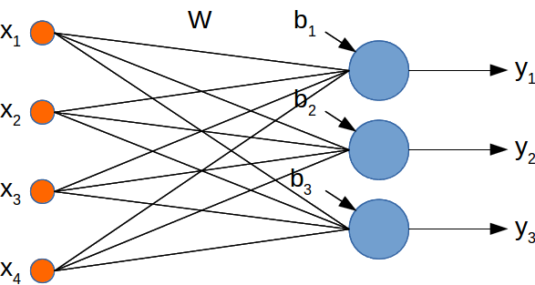
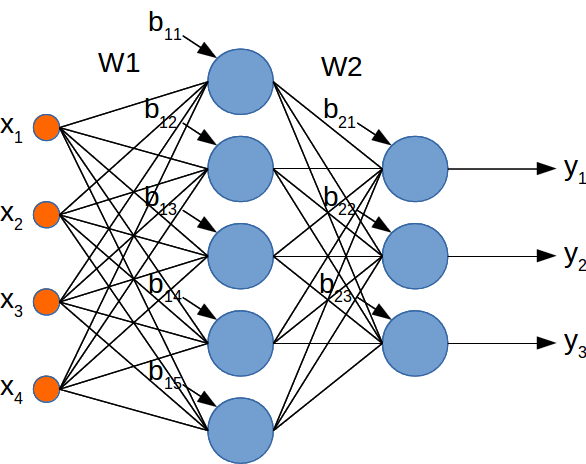

TC2: Redes Neuronales Artificiales
==================================

Alumnos
-------

* Eloy Pérez Reyes
* Rubén Lee Ramírez

Introducción
------------

En ese trabajo del curso consiste en crear una red neruonales artificiales
multicapa a partir de una red neuronales monocapa para clasificar las
características de la flor iris.

Redes Neuronales Monocapa
--------------------------

El modelo de las redes neuronales monocapa resuelve el sistema linealmente
separable. En nuestro caso no son linealmente separables·



Redes Neuronales Multicapa
-------------------------
El modelo de las redes neronales multicapa puede resolver el sistema no
linealmente separable de clases.



Código
------

Definir y generar valores aleatorios los pesos para 4 entradas -->  5 ocultas:

```{language:Python}
W1 = tf.Variable(np.float32(np.random.rand(4, 5))*0.1)
b1 = tf.Variable(np.float32(np.random.rand(5))*0.1)
```

Definir y generar valores aleatorios los pesos para 5 ocultas -->  3 salidas:

```{language:Python}
W2 = tf.Variable(np.float32(np.random.rand(5, 3))*0.1)
b2 = tf.Variable(np.float32(np.random.rand(3))*0.1)
```

Calcular los pesos de entrada --> oculta:

```{language:Python}
oculta = tf.sigmoid(tf.matmul(x, W1) + b1)
```

Calcular los pesos de oculta --> salida:

```{language:Python}
y = tf.nn.softmax(((tf.matmul(oculta, W2) + b2)))
```

Conclusión
----------

Despues de entrenamiento, el error para las RNAs monocapa es mayor que 12,9, es
decir no puede clasificar no lineamente separable.


El error de las RNAs multicapa el error tiende a 0, nos dice que se resuelve el
problema no linealmente separable.


Bibliografía
------------

* Repositorio de Cayetano Guerra: https://github.com/cayetanoguerra/fsi.git
